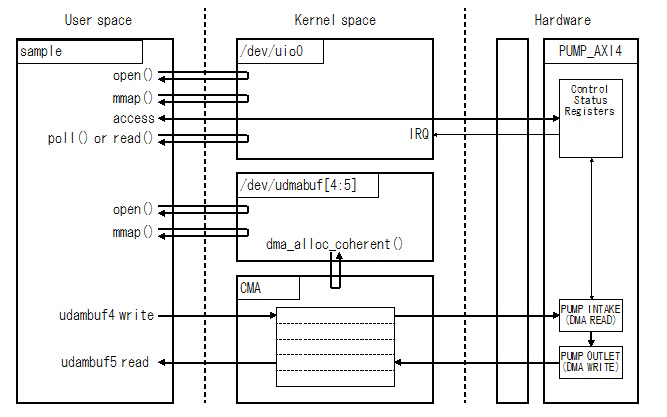
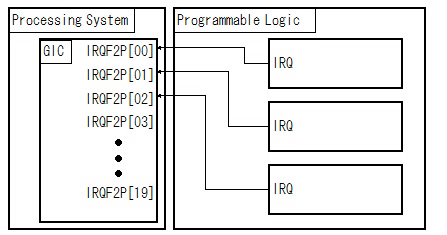
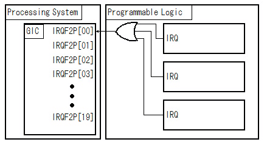
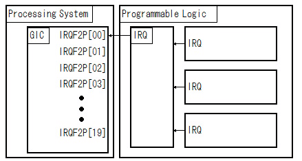

# UIO(User space IO)の割り込みの使い方の例


## はじめに


### UIOとは


UIOはユーザー空間でデバイスドライバを作成する仕組みです。

ユーザー空間でUIOを利用する際は、/dev/uio0をopenしてmmapすると、デバイスのレジスタ空間が見えます。/dev/uio0 にライトすると割り込みを許可します。また、/dev/uio0をreadすると割り込みが起きるまでブロックします。

このプロジェクトではUIOの割り込みを使った例を示します。


### プロジェクトの構成


このプロジェクトではCPUとしてXilinx社のZYNQを使用します。ZYNQはCPUにARM社のCortex-A9を搭載したFPGAです。

FPGAのPL(Programmable Logic)部には簡単なDMAコントローラをプログラムしています。このプロジェクトではDMAコントローラを動作させて、終了の割り込みが上がるのを待つようにしています。

また、ユーザー空間からDMAバッファをアクセスするために、udmabufを使っています。




図1 構成

<br />


このプロジェクトのソースこちらにあります。

https://github.com/ikwzm/ZYBO_UIO_IRQ_SAMPLE


DMAコントローラーの詳細は次のURLを参照してください。

https://github.com/ikwzm/ZYBO_PUMP


udmabufの詳細は次のURLを参照してください。

https://github.com/ikwzm/udmabuf


### 対応プラットフォーム


* OS : Linux Kernel Version 3.6 - 3.8 , 4.12.
* CPU: ARM Cortex-A9 (ZYNQ)
* ボード: ZYBO


## UIOの割り込みの仕組み


### 割り込みの許可/禁止の設定


UIOでは割り込みの許可or禁止の設定は デバイスファイル(/dev/uio0)にwriteすることで設定します。書き込むデータは32bitのinteger でなければなりません。1をwriteすることで割り込みを許可します。0をwriteすることで割り込みを禁止します。


```C:sample1.c
int uio_irq_on(int uio_fd)
{
    unsigned int  irq_on = 1;
    write(uio_fd, &irq_on, sizeof(irq_on));
}
int uio_irq_off(int uio_fd)
{
    unsigned int  irq_on = 0;
    write(uio_fd, &irq_on, sizeof(irq_on));
}

```


### read()による割り込み待ち


UIOでは read() を使って、割り込みが発生するまで読み出しプロセスをブロックできます。読み出すデータの型は32bitのintegerでなければなりません。


```C:sample1.c
int uio_wait_irq(int uio_fd)
{
    unsigned int  count = 0;
    return read(uio_fd, &count,  sizeof(count));
}

```


read()で読み出された値は、デバイスドライバがロードされてから割り込みが発生した総数を示します。

read()で割り込みを待つ場合、割り込みが発生するまで読み出しプロセスがブロックされます。プロセスをブロックしたくない場合やタイムアウト時間を設定したい場合は、次節のpoll()やppoll()を使って割り込み待ちをすることが出来ます。


### poll()による割り込み待ち


ppoll()を使って割り込み待ちをする例を示します。


```C:sample2.c
int uio_poll_irq(int uio_fd)
{
    struct pollfd   fds[1];
    struct timespec timeout;
    sigset_t        sigmask;
    int             poll_result;
    unsigned int    irq_count;
    fds[0].fd       = uio_fd;
    fds[0].events   = POLLIN;
    timeout.tv_sec  = 100;
    timeout.tv_nsec = 0;
    poll_result = ppoll(fds, 1, &timeout, &sigmask);
    if ((poll_result > 0) && (fds[0].revents & POLLIN)) {
        read(uio_fd, &irq_count,  sizeof(irq_count));
    }
    return poll_result;
}

```


poll()の戻り値が正の場合、割り込みが入っていることを示します。割り込みが入っている場合は、必ずread()を実行する必要があります。read()を実行しないと、UIO内部の割り込みフラグが残ったままになります。この場合、次の割り込み待ちの時、割り込みが入っていないにもかかわらず割り込み待ちの状態にならず、read()はブロックせずにすぐに戻ってしまいます。


### 連続して割り込みを受け付けたい場合


UIOの割り込みのロジックは、一度割り込みを受け付けると自動的に割り込みを禁止するようになっています。したがって、再度割り込み待ち状態に入る前に、デバイスファイル(/dev/uio0)に1をwrite()して割り込みを許可しなければなりません。


### UIOが管理する割り込みコントローラー


ZYNQの場合、UIOが制御する割り込みコントローラーはPS(Processing System)部の汎用割り込みコントローラ(GIC)までです。PL(Programmable Logic)部の割り込み制御までは関知しません。




図2 単純な割り込み制御の例

<br />




図3 PL部で複数の割り込み要求信号を論理和している例

<br />




図4 PL部で割り込みを制御している例

<br />


PL部で複数の割り込み信号を論理和していたり、PL部に独自の割り込みコントローラを持っている場合は、UIOで割り込みを受け付けた後、ユーザープロセスでこれらの割り込み信号を制御しなければなりません。


## プロジェクトの準備と実行


### プロジェクトのダウンロード


http://github.com/ikwzm/ZYBO_UIO_IRQ_SAMPLE.git からリポジトリをダウンロードします。


```Shell
zynq$ git clone git://github.com/ikwzm/ZYBO_UIO_IRQ_SAMPLE.git
Cloning into 'ZYBO_UIO_IRQ_SAMPLE'...
remote: Counting objects: 10, done.        
remote: Compressing objects: 100% (9/9), done.        
remote: Total 10 (delta 1), reused 10 (delta 1), pack-reused 0        
Receiving objects: 100% (10/10), 8.56 KiB, done.
Resolving deltas: 100% (1/1), done.
```


このプロジェクトでは ZYBO_PUMP と udmabuf をサブモジュールとして使用しているので、これらもダウンロードします。


```Shell
zynq$ cd ZYBO_UIO_IRQ_SAMPLE
```


```Shell
zynq$ git submodule init
Submodule 'ZYBO_PUMP' (git://github.com/ikwzm/ZYBO_PUMP.git) registered for path 'ZYBO_PUMP'
Submodule 'udmabuf' (git://github.com/ikwzm/udmabuf.git) registered for path 'udmabuf'
```


```Shell
zynq$ git submodule update
Cloning into 'ZYBO_PUMP'...
remote: Counting objects: 191, done.        
remote: Compressing objects: 100% (3/3), done.        
remote: Total 191 (delta 5), reused 4 (delta 4), pack-reused 184        
Receiving objects: 100% (191/191), 1.94 MiB | 443.00 KiB/s, done.
Resolving deltas: 100% (96/96), done.
Checking connectivity... done.
Submodule path 'ZYBO_PUMP': checked out '7bf3ed940a190b981cb83114293831ad7bd8bd89'
Cloning into 'udmabuf'...
remote: Counting objects: 162, done.        
remote: Compressing objects: 100% (4/4), done.        
remote: Total 162 (delta 2), reused 6 (delta 2), pack-reused 156        
Receiving objects: 100% (162/162), 132.27 KiB | 0 bytes/s, done.
Resolving deltas: 100% (87/87), done.
Checking connectivity... done.
Submodule path 'udmabuf': checked out 'c82c5f56cd88be5e7c35ba212e1c48d1bbf0f372'

```


### udmabufのビルド


udmabufは次のようにビルドします。詳細はudmabuf/Readme.md を参照してください。


```Shell
zynq# cd udmabuf
```


```Shell
zynq# make
make -C /usr/src/kernel M=/home/ichiro/udmabuf modules
make[1]: Entering directory '/usr/src/kernel'
  Building modules, stage 2.
  MODPOST 1 modules
WARNING: modpost: Found 1 section mismatch(es).
To see full details build your kernel with:
'make CONFIG_DEBUG_SECTION_MISMATCH=y'
  LD [M]  /home/ichiro/udmabuf/udmabuf.ko
make[1]: Leaving directory '/usr/src/kernel'
```


### ZYBO_PUMPのビルド


ZYBO_PUMPはZYNQのPL部のDMAコントローラとして使います。詳細はZYBO_PUMP/Readme.md を参照してください。ただ、最初からFPGAの論理合成、配置配線、ビットストリームファイルの生成、ブートローダーの生成をするのは、慣れていない人は手間取るかもしれません。

ZYBO_PUMPのリポジトリの1.1-build-projectリモートブランチにPL部にDMAコントローラがプログラムされたブートローダを用意しています。最初から作るのが面倒な人は、このブートローダを使ってください。


```Shell
zynq$ cd ZYBO_PUMP
```


```Shell
zynq$ git checkout -b 1.1-build-project origin/1.1-build-project
Previous HEAD position was 48e53f5... PUMP_AXI4 を ikwzm_pipework_pump_axi3_to_axi3_1.0 を使用するように変更.
Branch 1.1-build-project set up to track remote branch 1.1-build-project from origin.
Switched to a new branch '1.1-build-project'
```


```Shell
zynq$ ls -la boot/BOOT.bin
```


### デバイスツリーファイルの準備


このプロジェクトではDMAコントローラーのレジスタアクセスと割り込みをUIOで行い、またDMAバッファをudmabufで確保します。そのためにはLinuxが起動するときのデバイスツリーに以下の内容を追加しておく必要があります。


```devicetree:devicetree.dts
		pump-uio@43c10000 {
			compatible = "generic-uio";
			reg = <0x43c10000 0x1000>;
			interrupt-parent = <0x3>;
			interrupts = <0x0 0x1d 0x4>;
		};
		pump-udmabuf4@43c10000 {
			compatible = "ikwzm,udmabuf-0.10.a";
			minor-number = <4>;
			size = <0x00400000>;
		};
		pump-udmabuf5@43c10000 {
			compatible = "ikwzm,udmabuf-0.10.a";
			minor-number = <5>;
			size = <0x00400000>;
		};

```


UIOのデバイスドライバのエントリーはpump-uio@43c10000です。ここにレジスタのアドレスと範囲および割り込み番号を指定します。

このプロジェクトではDMAコントローラーのレジスタは0x43C1000に割り当てています。

interrupts=\<0x0 0x1d 0x4\> の２番目のパラメータの0x1d(十進数で29)がこの割り込み番号を指定しています。DMAコントローラーの割り込みはPS部のIRQ_F2P[0]に接続しています。ZYNQのテクニカルリファレンスマニュアルによれば、IRQ_F2P[0]は汎用割り込みコントローラー(GIC)内の共有ペリフェラル割り込み(SPI)の61番を通じて割り込みがかかります。61から32引いた値を設定するようです。

interrupts=\<0x0 0x1d 0x4\>の１番目のパラメータはGIC内部の割り込みの種類を指定します。GIC内部には共有ペリフェラル割り込み(SPI)の他にCPUプライベートペリフェラル割り込み(PPI)とソフトウェア生成割り込み(SGI)があります。共有ペリフェラル割り込み(SPI)を使う場合は0を指定します。

interrupts=\<0x0 0x1d 0x4\>の３番目のパラメータは割り込み信号がエッジトリガーかレベルトリガーかを指定します。1を指定するとエッジトリガー、4を指定するとレベルトリガーになります。

udmabufはリード用とライト用の二つ用意しています。マイナー番号はそれぞれ4番と５番を割り当てています。バッファのサイズは0x400000(4MByte)です。

用意したデバイスツリーファイルをバイナリーに変換します。


```Shell
zynq$ dtc -I dts -O dtb -o devicetree.dtb devicetree.dts
```


```Shell

```


### Linuxのブート


このプロジェクトで用意したBOOT.bin と devicetree.dtb、さらにLinuxのカーネルイメージ(uImage)とルートファイルシステムをSDカードに書き込んでブートします。ここらへんの詳細は省略します。


### udmabufのロード


Linuxが起動したらudmabufをロードします。


```Shell
zynq# insmod udmabuf.ko
udmabuf pump-udmabuf4.1: driver probe start.
udmabuf udmabuf4: driver installed
udmabuf udmabuf4: major number   = 248
udmabuf udmabuf4: minor number   = 4
udmabuf udmabuf4: phys address   = 0x1e900000
udmabuf udmabuf4: buffer size    = 4194304
udmabuf pump-udmabuf4.1: driver installed.
udmabuf pump-udmabuf5.2: driver probe start.
udmabuf udmabuf5: driver installed
udmabuf udmabuf5: major number   = 248
udmabuf udmabuf5: minor number   = 5
udmabuf udmabuf5: phys address   = 0x1ed00000
udmabuf udmabuf5: buffer size    = 4194304
udmabuf pump-udmabuf5.2: driver installed.
```


正常にロードすれば、デバイスツリーで指定したudmabuf4とudmabuf5が生成されます。


### サンプルコードのビルドと実行


```Shell
zynq# cd c-sample
```


```Shell
zynq# gcc sample1.c -o sample1
```


```Shell
zynq# ./sample1
time = 0.023007 sec
time = 0.022742 sec
time = 0.022855 sec
time = 0.022875 sec
time = 0.022648 sec
time = 0.022988 sec
time = 0.022893 sec
time = 0.022988 sec
time = 0.023158 sec
time = 0.023121 sec
```


```Shell
zynq# cd c-sample
```


```Shell
zynq# gcc sample2.c -o sample2
```


```Shell
zynq# ./sample2
time = 0.022875 sec
time = 0.022988 sec
time = 0.022667 sec
time = 0.022932 sec
time = 0.023026 sec
time = 0.022894 sec
time = 0.022912 sec
time = 0.023045 sec
time = 0.023064 sec
time = 0.022894 sec
```


```Shell
zynq# cd python-sample
```


```Shell
zynq# python3 sample.py
elapsed_time:87.862[msec]
elapsed_time:87.648[msec]
elapsed_time:87.638[msec]
elapsed_time:87.634[msec]
elapsed_time:87.658[msec]
elapsed_time:87.73[msec]
elapsed_time:87.752[msec]
elapsed_time:87.626[msec]
elapsed_time:87.688[msec]
average_time:87.693[msec]
thougput    :191.318[MByte/sec]
udmabuf4 == udmabuf5 : OK
```
